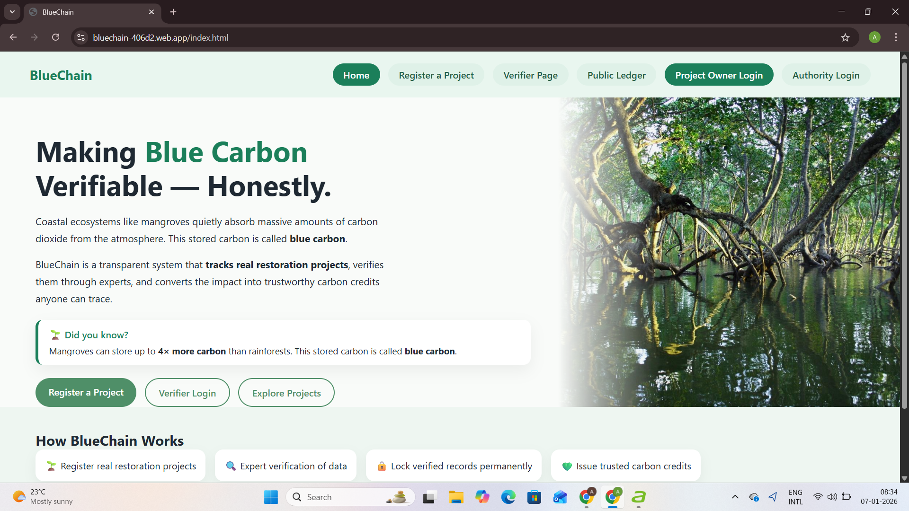
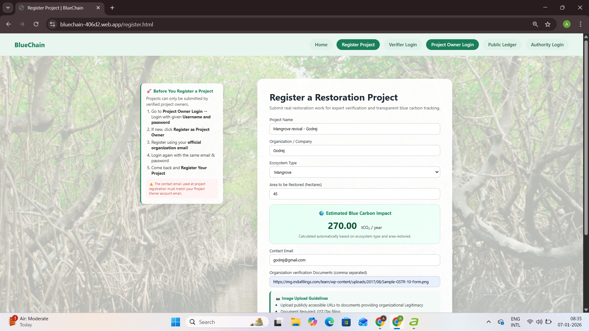
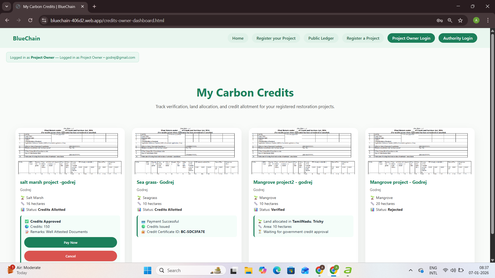
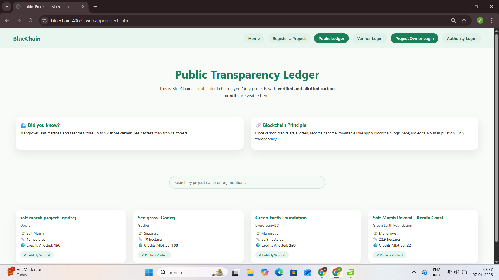

🌍 BlueChain

A Role-Based Platform for Transparent Carbon Credit Verification & Allotment

Built for Smart India Hackathon (SIH)
A demo-ready system showcasing how carbon credits can be transparently managed using role-based governance and auditable workflows.

⸻

📌 Purpose of the Project

Industries and companies across the world generate carbon emissions through manufacturing, energy consumption, and large-scale operations.
To reduce environmental damage, governments mandate that such organizations offset their emissions by purchasing carbon credits.

Carbon credits are earned through:
	•	Afforestation & reforestation projects
	•	Renewable energy initiatives
	•	Environmental restoration programs

However, current carbon credit systems often suffer from:
	•	Lack of transparency
	•	Manual verification
	•	Centralized control
	•	Risk of fraud and double counting

BlueChain addresses these challenges by simulating a transparent, role-based digital ecosystem where carbon credits are:
	•	Verified by experts
	•	Approved by authorities
	•	Publicly auditable

⸻

❗ Problem Statement

The existing carbon credit ecosystem lacks:
	•	Clear verification workflows
	•	Public transparency
	•	Proper separation of authority roles
	•	Trust in approval and allotment mechanisms

This makes it difficult for governments, companies, and the public to confidently rely on carbon offset data.

⸻

✅ Proposed Solution

BlueChain provides a structured digital platform that:
	•	Separates responsibilities between stakeholders
	•	Ensures projects move through defined approval stages
	•	Maintains a transparent public ledger
	•	Prevents unauthorized access through role-based control

The system mimics real-world governance logic used in environmental regulation.

⸻

🧠 System Overview

BlueChain is a multi-role, workflow-driven system consisting of four primary actors:

👥 Roles & Responsibilities

🧑‍💼 Project Owner
	•	Registers carbon offset projects
	•	Submits project details for verification
	•	Tracks project status and credit approval
	•	Initiates payment once credits are allotted

🔍 Verifier (Experts)
	•	Environmental scientists / forest officers / NGOs
	•	Reviews submitted projects
	•	Verifies authenticity and legitimacy
	•	Approves or rejects projects
	•	Allocates restoration land

🏛️ Government Authority (Admin)
	•	Reviews verified projects
	•	Allots carbon credits
	•	Approves final credit certification
	•	Enables payment stage

🌐 Public User
	•	Views all approved projects
	•	Tracks project status
	•	Ensures transparency through a public ledger

⸻

🔐 Authentication & Access Control
	•	Separate login modules for each role
	•	Role-based access enforcement
	•	Session persistence using browser storage (demo auth)
	•	Identity badges showing logged-in role & email
	•	Unauthorized access is restricted

⚠️ Note: Authentication is frontend-based for demo purposes.

⸻

🔄 Project Workflow

Project Registration →
Pending Verification →
Verified by Experts →
Awaiting Authority Approval →
Carbon Credits Allotted →
Payment Enabled

Each project moves only forward, ensuring governance integrity.

⸻

✨ Key Features
	•	✅ Role-based dashboards
	•	✅ Separate login modules for each role
	•	✅ Status-driven project lifecycle
	•	✅ Verifier approval & land allocation
	•	✅ Authority-controlled credit allotment
	•	✅ Conditional payment trigger logic
	•	✅ Transparent public ledger
	•	✅ Judge-friendly demo mode
	•	✅ Defensive UI logic (no broken flows)

⸻

🧾 Modules Implemented
	•	Project Registration Module
	•	Verifier Review Module
	•	Authority Credit Allotment Module
	•	Public Ledger Module
	•	Identity & Session Management

⸻

💳 Payment Gateway (Important Note)

🚫 Payment gateway is NOT implemented

✔ The system clearly demonstrates:
	•	Where payment occurs
	•	When payment becomes available
	•	Which role triggers payment

This design allows easy future integration with real gateways (Razorpay, Stripe, etc.).

⸻

🔮 Future Enhancements
	•	🔗 Integration with blockchain platforms (Ethereum / Polygon)
	•	📜 Smart contracts for automated credit issuance
	•	🧾 Immutable on-chain audit logs
	•	💰 Real payment gateway integration
	•	🔐 Backend authentication & database
	•	📊 Emission analytics & reporting

⸻

🖼️ Screenshots

⸻

🛠️ Tech Stack
	•	HTML
	•	CSS
	•	JavaScript
	•	Browser Local Storage (Demo Auth)

⸻

🏁 Conclusion

BlueChain demonstrates how transparent governance, structured workflows, and role-based access control can improve trust in carbon credit systems.

This project focuses on clarity, feasibility, and real-world logic, making it suitable for academic evaluation, hackathons, and future expansion.

⸻

🏆 Hackathon Note

This project was developed as part of the Smart India Hackathon (SIH) and is intended as a functional prototype showcasing system design and governance logic.

⸻

